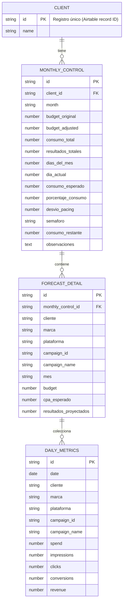

# ERD - MediaPulse RHD

El sistema contempla tres tablas principales que se conectan para permitir forecast, ejecución y control en tiempo real.

## Notas

- `Monthly Control` es el nivel de control por cliente + mes.
- `Forecast Detail` es el nivel táctico de presupuesto por marca/plataforma/campaña.
- `Daily Metrics` trae datos diarios de campaña desde APIs de Meta/Google.
- La relación clave se soporta con `campaign_id` y `cliente + mes`.
