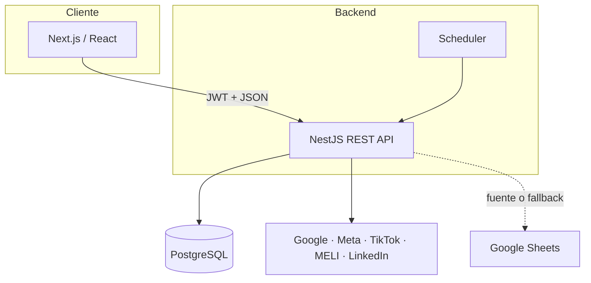
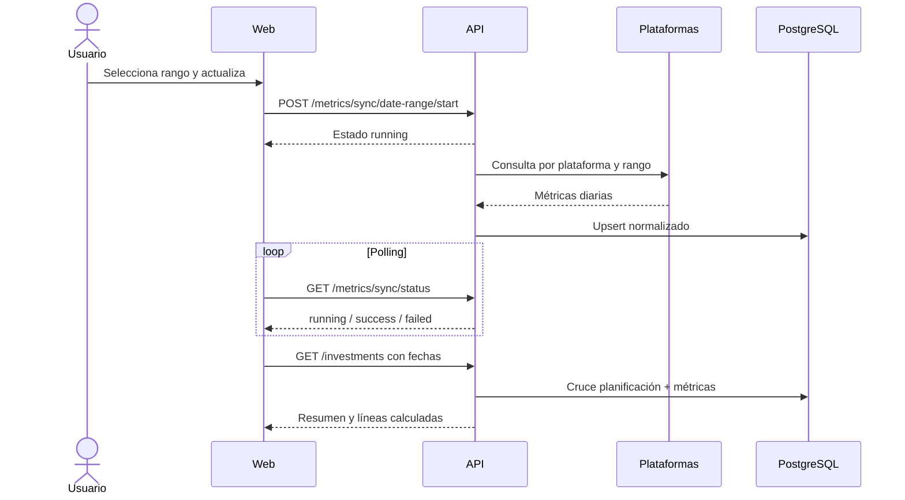

# MediaPulse RHD — Documentación técnica y operativa V1

> Documento preparado para importar o copiar en Notion.  
> Última revisión: 30 de julio de 2026  
> Estado: V1 operativa  
> Propietario técnico: _completar_  
> Propietario funcional: _completar_

---

## 1. Resumen

MediaPulse RHD centraliza la planificación y el seguimiento de inversiones publicitarias. Combina presupuestos cargados por el equipo con consumos obtenidos desde plataformas externas y produce indicadores de ritmo, desvío y proyección.

### Objetivo de V1

Disponer de una vista única, auditable y filtrable para responder:

- ¿Cuánto se presupuestó?
- ¿Cuánto se consumió en el rango seleccionado?
- ¿Cuál fue el consumo de ayer y del día actual?
- ¿Cuánto queda disponible?
- ¿La inversión está por encima o por debajo del ritmo?
- ¿Cuántos resultados y qué facturación se proyectan?

### Fuera de alcance de V1

- facturación contable;
- atribución multicanal;
- edición de campañas dentro de las plataformas;
- data warehouse histórico independiente;
- alta disponibilidad con múltiples réplicas coordinadas.

---

## 2. Usuarios y permisos

| Rol | Acceso esperado |
| --- | --- |
| `ADMIN` | Administración, carga, edición, aprobación y vista general |
| `MEDIA` | Carga, edición, aprobación y operación del consumo |
| `CLIENT` | Consulta de información habilitada para el cliente |

> **Acción V1.1:** cerrar `POST /auth/users` con autorización administrativa explícita.

---

## 3. Funcionalidades

### Control

- vista general o por cliente;
- filtros de anunciante, marca, moneda, plataforma y objetivo;
- presets Hoy, Ayer, Este mes, Mes anterior y Personalizado;
- resumen de presupuesto, consumo, restante, ritmo y completitud;
- detalle por campaña;
- comentarios sobre desvíos;
- sincronización manual con estado visible.

### Forecast

- agrupación por cliente y marca;
- presupuesto y facturación proyectada por moneda;
- cambio de estado entre En proceso y Presupuesto OK;
- edición y baja lógica;
- historial por línea.

### Carga manual

Campos:

| Campo | Descripción |
| --- | --- |
| Mes | Mes presupuestado |
| Anunciante | Cliente principal |
| Marca | Marca asociada |
| Plataforma | Origen publicitario |
| Moneda | `ARS`, `USD` o `CHL` |
| Objetivo | Objetivo de campaña |
| Campaña | Nombre o referencia |
| Presupuesto | Inversión planificada |
| Costo por resultado | Supuesto para proyectar resultados |
| Ticket promedio | Supuesto para proyectar facturación |

El modal “Valores previos” muestra únicamente campañas del mes calendario anterior al mes cargado.

---

## 4. Arquitectura



### Componentes

| Componente | Ubicación | Responsabilidad |
| --- | --- | --- |
| Web | `apps/web` | Experiencia de usuario, filtros y polling |
| API | `apps/api` | Reglas, autenticación, cálculos e integraciones |
| Shared | `packages/shared` | Contratos TypeScript |
| PostgreSQL | servicio externo | Persistencia transaccional |
| Scheduler | dentro de API | Ingesta diaria 10:15 ART |

### Ambientes

| Ambiente | Web | API | Base |
| --- | --- | --- | --- |
| Local | Next dev | Nest/ts-node-dev | PostgreSQL local o remoto |
| Producción | Vercel | Render | PostgreSQL administrado |

---

## 5. Flujo de datos



### Reglas de fechas

- formato canónico: `YYYY-MM-DD`;
- inicio y fin son inclusivos;
- la fuente debe recibir el rango elegido, no un acumulado fijo;
- preset y personalizado deben devolver lo mismo si las fechas coinciden;
- zona horaria de negocio: `America/Argentina/Buenos_Aires`;
- el día actual se distingue visualmente en el calendario;
- el consumo del día y de ayer se calcula con sus fechas efectivas.

---

## 6. Integraciones

| Plataforma | Canal | Identificador | Rango | Persistencia/estado |
| --- | --- | --- | --- | --- |
| Google Ads | API oficial | Customer ID | Custom | PostgreSQL |
| Meta | Marketing API | Account ID | Custom | PostgreSQL |
| TikTok | Business API | Advertiser ID | Custom | PostgreSQL |
| Mercado Libre | API oficial | Advertiser + PADS/DSP | Custom diario | PostgreSQL + OAuth persistido |
| LinkedIn | Supermetrics | Account ID | Custom | PostgreSQL |
| Google Sheets | API de Sheets | Spreadsheet/range | Según fuente | Lectura externa |

### Mercado Libre

- usa agregación diaria para respetar filtros;
- separa productos PADS y DSP;
- refresca OAuth automáticamente;
- guarda access token, refresh token y expiración en `mercado_libre_oauth_state`;
- el archivo `MERCADO_LIBRE_OAUTH_STATE_PATH` funciona sólo como fallback;
- una respuesta parcial no debe reemplazar datos válidos como si fuera completa.

---

## 7. Modelo de información

### Entidades

| Entidad | Clave funcional | Retención |
| --- | --- | --- |
| Usuario | Email | Mientras esté activo |
| Línea de inversión | Mes + dimensiones de campaña | Baja lógica |
| Métrica diaria | Fecha + campaña + plataforma | Histórica |
| Mapping de marca | Cliente + marca | Vigente |
| Log manual | Línea + evento | Auditoría |
| Comentario | Línea + fecha | Auditoría |
| OAuth MELI | Proveedor/estado activo | Se actualiza al refrescar |

### Cálculos

```text
restante = presupuesto - consumo
porcentaje_consumo = consumo / presupuesto
nuevo_presupuesto_diario = restante / días_restantes
resultados_proyectados = presupuesto / costo_por_resultado
fc_proyectada = resultados_proyectados × ticket_promedio
```

Los cálculos deben proteger divisiones por cero y conservar la moneda de la línea.

---

## 8. API y contratos

Swagger: `/api/docs`

| Dominio | Base path |
| --- | --- |
| Auth | `/auth` |
| Inversiones | `/investments` |
| Métricas | `/metrics` |
| Mapeo de marcas | `/brand-mapping` |
| Forecast | `/forecast` |
| Control | `/control` |

Autenticación:

```http
Authorization: Bearer <JWT>
```

La API valida DTO, rechaza campos no declarados y normaliza errores HTTP.

---

## 9. Configuración

La lista base se mantiene en `.env.example`.

### Secretos

- `DATABASE_URL`
- `JWT_SECRET`
- tokens, client IDs y client secrets de plataformas;
- API keys de Supermetrics y Google Sheets.

### Configuración operativa

- IDs de cuentas/anunciantes;
- productos MELI;
- rangos de Google Sheets;
- timeouts de cada proveedor;
- tamaño y timeouts del pool.

### Política

1. Los secretos viven en el gestor de variables del proveedor.
2. Nunca se copian al repositorio, tickets o capturas.
3. Una rotación exige actualizar sólo el proveedor afectado.
4. Los refresh tokens que administra la aplicación se persisten en base.
5. Los valores nuevos se agregan también a `.env.example`, sin secretos.

---

## 10. Runbook de despliegue

### Pre-release

- [ ] API compila.
- [ ] Web compila.
- [ ] No hay secretos en el diff.
- [ ] El esquema requerido existe o puede inicializarse.
- [ ] Variables nuevas documentadas.
- [ ] Cambio probado con rango corto y rango mensual.

### Backend

1. Desplegar la rama aprobada en Render.
2. Esperar estado healthy.
3. Validar `GET /health`.
4. Abrir `/api/docs`.
5. Revisar logs de conexión y creación de tablas.

### Frontend

1. Confirmar `NEXT_PUBLIC_API_BASE`.
2. Desplegar en Vercel.
3. Validar login y rutas `/control` y `/carga-manual`.
4. Confirmar que el build corresponda al commit esperado.

### Smoke test

- [ ] Login válido e inválido.
- [ ] Vista general y vista por cliente.
- [ ] Este mes vs. personalizado con iguales fechas.
- [ ] Fecha final diferente produce consumo diferente.
- [ ] Sincronización termina en `success` o informa fuente fallida.
- [ ] Consumo de ayer coincide con la plataforma.
- [ ] Alta, edición, confirmación e historial manual.
- [ ] Costo por resultado visible en Control.
- [ ] OAuth MELI sigue vigente tras reiniciar backend.

---

## 11. Runbook de incidentes

### A. “Sincronizando…” durante varios minutos

**Diagnóstico**

1. Consultar `/metrics/sync/status?key=consumption`.
2. Buscar en logs inicio/fin por plataforma.
3. Revisar timeout, rate limit y credenciales.
4. Probar una cuenta y rango pequeño.

**Mitigación**

- aislar la fuente fallida;
- conservar resultados válidos de otras fuentes;
- reintentar sólo el rango afectado;
- no elevar el pool de DB sin medir conexiones.

### B. Mismo consumo para fechas diferentes

**Diagnóstico**

- inspeccionar `startDate`/`endDate` enviados;
- validar que la consulta externa usa ambos;
- revisar cache y snapshots mensuales;
- comparar preset contra personalizado.

**Criterio de cierre**

Dos rangos distintos con gasto distinto en origen deben producir consumos distintos en MediaPulse.

### C. Timeout de PostgreSQL

- validar disponibilidad de la base;
- revisar conexiones activas;
- mantener un pool pequeño por instancia;
- confirmar `DB_POOL_CONNECTION_TIMEOUT_MS`;
- buscar consultas externas ejecutadas mientras una conexión queda retenida.

### D. Mercado Libre inconsistente

- confirmar advertiser y producto;
- comprobar agregación `DAILY`;
- revisar refresh OAuth;
- validar paginación y rango inclusivo;
- contrastar contra el panel con la misma cuenta y moneda.

---

## 12. Observabilidad

### Disponible en V1

- logs estructurados por servicio NestJS;
- health check;
- estado de sincronización;
- timestamp de última actualización;
- historial de cambios manuales.

### Recomendado para V1.1

- correlation ID por sincronización;
- duración, filas y error por fuente;
- alertas por scheduler fallido;
- dashboard de conexiones PostgreSQL;
- persistencia distribuida del estado de jobs;
- tracking de versión/commit visible en la aplicación.

---

## 13. Seguridad

### Estado actual

- JWT;
- roles de negocio;
- validación de payloads;
- auditoría de planificación;
- SQL parametrizado.

### Pendientes prioritarios

1. Reemplazar SHA-256 por Argon2/bcrypt con salt.
2. Proteger creación de usuarios con rol ADMIN.
3. Restringir CORS.
4. Aplicar rate limiting a login y sincronización.
5. Rotar secretos y registrar responsables/fecha.
6. Incorporar migraciones y backups probados.

---

## 14. Riesgos y deuda técnica

| Riesgo | Impacto | Prioridad |
| --- | --- | --- |
| Estado de jobs en memoria | Inconsistencia con múltiples instancias | Alta |
| Sin tests automáticos suficientes | Regresiones en cálculos y fechas | Alta |
| Hash de contraseña débil | Riesgo de credenciales | Alta |
| Tablas creadas desde repositorios | Cambios de esquema difíciles de auditar | Alta |
| Dependencia de APIs externas | Datos parciales o demorados | Media |
| Código de moneda `CHL` | Ambigüedad frente a ISO `CLP` | Media |
| Documentos históricos desactualizados | Contratos contradictorios | Media |

---

## 15. Roadmap sugerido V1.1

- [ ] Migraciones versionadas.
- [ ] Test unitarios de fórmulas y fechas.
- [ ] Test de integración por adaptador externo.
- [ ] Cola persistente de sincronización.
- [ ] Reintentos con backoff y circuit breaker.
- [ ] RBAC declarativo en controladores.
- [ ] Argon2/bcrypt y flujo de recuperación.
- [ ] Métricas y alertas operativas.
- [ ] Migración `CHL` → `CLP`.
- [ ] Actualización automática del ERD y OpenAPI en CI.

---

## 16. Registro de decisiones

| Fecha | Decisión | Motivo |
| --- | --- | --- |
| 2026-07 | Consultar cada plataforma con el rango seleccionado | Evitar consumos estáticos o acumulados incorrectos |
| 2026-07 | Ejecutar sync manual en background con polling | Evitar timeouts HTTP largos |
| 2026-07 | Pool PostgreSQL conservador por instancia | Adaptarse al límite del proveedor |
| 2026-07 | Persistir OAuth MELI en PostgreSQL | Evitar actualizar envs en cada refresh |
| 2026-07 | Valores previos sólo del mes anterior | Mantener semántica correcta de autocompletado |
| 2026-07 | Zona horaria Buenos Aires | Alinear días de negocio y panel |

---

## 17. Contactos

| Responsabilidad | Persona/canal |
| --- | --- |
| Producto | _completar_ |
| Backend | _completar_ |
| Frontend | _completar_ |
| Datos/integraciones | _completar_ |
| Infraestructura | _completar_ |
| Incidentes | _completar_ |

---

## 18. Definición de documentación vigente

- El `README.md` del repositorio es la guía técnica de desarrollo.
- Esta página es la guía operativa y de conocimiento compartido.
- Swagger es el contrato ejecutable de endpoints.
- El código y el esquema desplegado prevalecen ante documentos históricos.
- Toda modificación funcional debe actualizar al menos uno de estos documentos.
